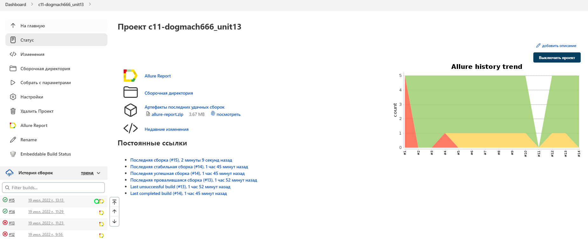

# Проект по автоматизации тестирования для Wildberries
<a target="_blank" href="https://www.wildberries.ru">Веб сайт Wildberries</a>

## Содержание:

-:heavy_check_mark: [Технологии и инструменты](#технологии-и-инструменты)
-:heavy_check_mark: [Реализованные проверки](#реализованные-проверки)
-:heavy_check_mark: [Сборка в Jenkins](#параметры-сборки-в-jenkins)
-:heavy_check_mark: [Запуск из терминала](#запуск-тестов-из-терминала)
-:heavy_check_mark: [Allure отчет](#-отчет-в-allure-report)
-:heavy_check_mark: [Отчет в Telegram](#-уведомление-в-telegram-при-помощи-бота)
-:heavy_check_mark: [Видео примеры прохождения тестов](#-видео-прохождения-теста)

## Технологии и инструменты

<p align="center">
<a href="https://www.jetbrains.com/idea/"></a>
<a href="https://www.java.com/"></a>
<a href="https://github.com/"></a>
<a href="https://junit.org/junit5/"></a>
<a href="https://gradle.org/"></a>
<a href="https://selenide.org/"></a>
<a href="https://aerokube.com/selenoid/"></a>
<a href="https://github.com/allure-framework/allure2"></a>
<a href="https://www.jenkins.io/"></a>
</p>

## Реализованные проверки

- ✓ Проверка наличия слова Wildberries в хедере.
- ✓ Проверка работоспособности поиска товаров на главной странице сайта и отображение количества товаров.
- ✓ Добавление самых популярных мужских брюк в корзину.
- ✓ Проверка виджета смены языка с Русского на Белорусский.
- ✓ Проверка на наличие ошибок в console log.

## </a> работа в <a target="_blank" href="https://jenkins.autotests.cloud/job/c11-dogmach666_unit13/"> Jenkins </a>
<p align="center">
<a href="https://jenkins.autotests.cloud/job/c11-dogmach666_unit13/"></a>
</p>

### Параметры сборки в Jenkins:

- user (логин удалённого браузера)
- password (пароль удаленного браузера)
- remoteBrowser (адрес удаленного сервера Selenoid с параметрами user & password)
- browser (браузер, по умолчанию chrome)
- size (размер окна браузера, по умолчанию 1920x1080)
- version (версия браузера, по умолчанию 99.0)

## Запуск тестов из терминала

Локальный запуск:
```
gradle clean test
```

Удаленный запуск:
```
clean
test
-Duser=${USER}
-Dpassword=${PASSWORD}
-DremoteBrowser=${REMOTE_BROWSER}
-Dbrowser=${BROWSER}
-Dsize=${BROUSERSIZE}
-Dversion=${VERSION}
```

## </a> Отчет в <a target="_blank" href="https://jenkins.autotests.cloud/job/c11-dogmach666_unit13/2/allure/">Allure report</a>

### Основное окно

<p align="center">

</p>

### Тесты

<p align="center">

</p>

### Графики

<p align="center">

</p>

## </a> Уведомление в Telegram при помощи бота

<p align="center">

</p>


## </a> Видео прохождения теста

<p align="center">
 
</p>
